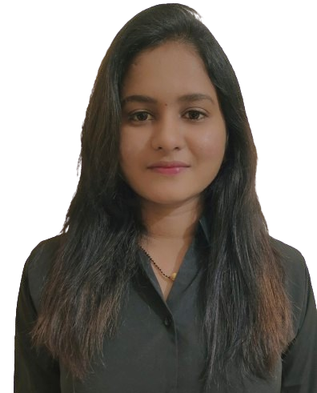

# Portfolio

Welcome to my portfolio! Here, I proudly present my skills, accomplishments, and creative journey in the field of development. This collection is a reflection of my unwavering passion for the craft and my continuous pursuit of excellence.

<!--  -->
## Introduction

Greetings! I am thrilled to share my development journey with you through this portfolio. I have dedicated myself to honing my skills, embracing challenges, and delivering innovative solutions. This portfolio serves as a testament to my commitment to excellence and my passion for continuous learning.

## Skills

- Web Development (HTML, CSS, JavaScript, React, etc.)
- Database Management ( MongoDB,Mongoose )
- Version Control (Git, GitHub)
- Problem Solving and Algorithmic Thinking

## Projects

### Project 1: E-Learning
The objective of a language learning website is to provide an engaging platform for users to learn and master a new language. It aims to offer effective, personalized lessons, interactive activities, and cultural insights.",

### Project 2: Sugar Clone
This project is a practice exercise to recreate the landing page of Sugar Cosmetics using HTML, CSS, and JavaScript. The objective is to enhance coding and testing skills..",

### Project 3: Figma clone
This project is a practice exercise to recreate the landing page of figma design using HTML, CSS, and SCSS. The objective is to enhance coding and testing skills.",.

## Contact

I would love to connect with you and discuss collaboration opportunities or answer any questions you might have. Feel free to reach out to me through the following channels:

- Email: renukasjagrwal@gmail.com
- LinkedIn: (https://www.linkedin.com/in/renuka-jagrwal-5b64b6252/)
- Portfolio Website: (https://Renuka19990.github.io)

Thank you for taking the time to explore my portfolio. I look forward to the possibility of working together and contributing to exciting projects.
r 